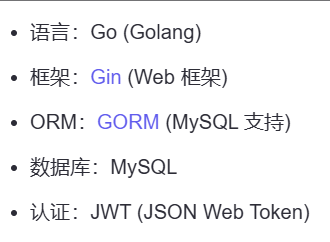
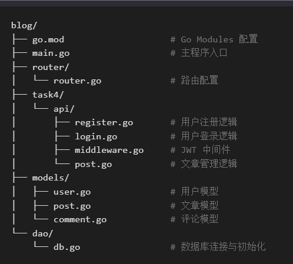
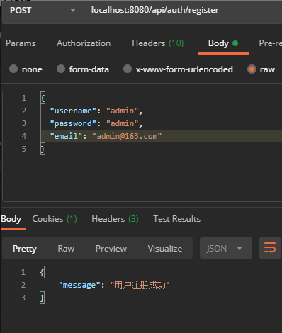
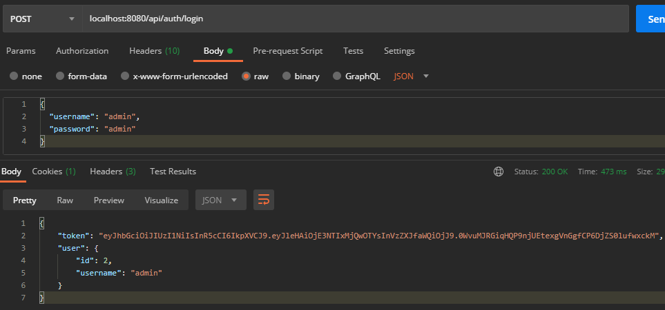
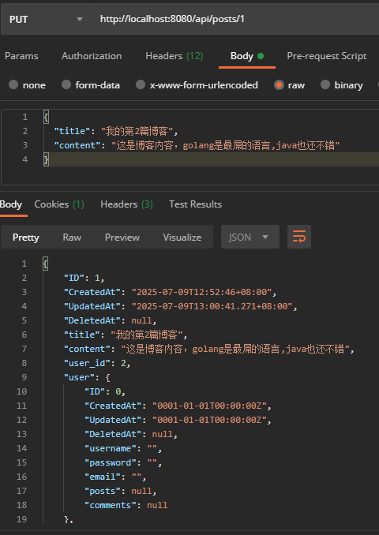
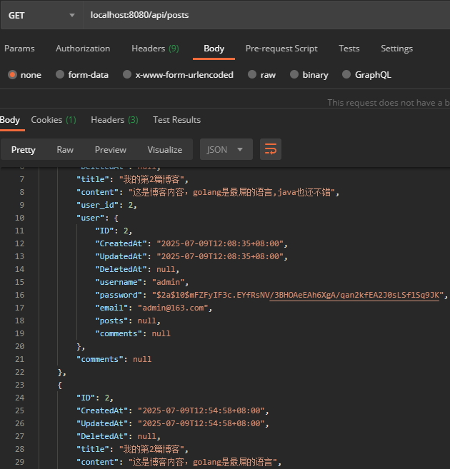
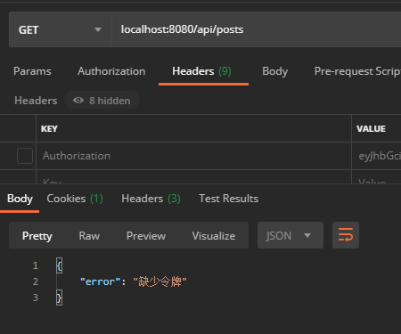

# golang-learn
🚀 项目简介
该项目是一个基于 Go + Gin+GORM 框架的博客系统，包含用户注册、登录、文章管理、评论管理等功能，使用 JWT 实现用户认证，使用 mysql 作为数据库。

🐧 技术栈

📦 依赖安装步骤
go mod tidy

📁 项目结构

▶️ 启动方式
初始化数据库
go run main.go
自动创建 blog.db 数据库文件并初始化表结构。

启动服务
go run main.go
默认监听端口：8080
http://localhost:8080/api/auth/register
http://localhost:8080/api/auth/login
http://localhost:8080/api/posts

🧪 接口测试 

✅ 推荐工具  Postman 或 curl

📌 测试用例 1: 
用户注册
请求方法: POST
URL: http://localhost:8080/api/auth/register

📌 测试用例 
2: 用户登录
URL: http://localhost:8080/api/auth/login
请求方法: POST

📌 测试用例 3:
创建文章（需登录）
请求方法: POST
URL: http://localhost:8080/api/posts

📌 测试用例 
4: 获取文章列表
请求方法: GET
URL: http://localhost:8080/api/posts

📌 测试用例 
5: 无效 Token 访问受保护接口
请求方法: GET
URL: http://localhost:8080/api/posts

🧾 测试结果示例

接口	请求参数	响应状态码	响应内容

/register	用户名已存在	409 Conflict	{"error": "用户名已存在"}

/login	密码错误	401 Unauthorized	{"error": "无效的用户名或密码"}

/posts	无 Token	401 Unauthorized	{"error": "未提供令牌"}

📌 项目扩展建议

添加 Swagger 文档支持（使用 swaggo/gin-swagger）

支持 MySQL 或 PostgreSQL 数据库

添加分页功能到文章列表接口

增加单元测试覆盖率
